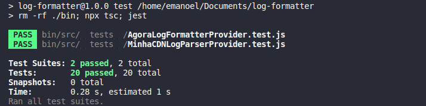

# **Log Formatter CLI**

Command Line Application responsible for getting, formatting and saving logs.

With the params flags, we can change the origin of logs and also de format they are saved.<br>

## **Requirements**

- [NodeJS](https://nodejs.org/en/download/) v14.15.1

## **Installation**

To **install** the cli just need to run the command below inside root folder:

```
  npm i
  npm install -g .
```

To **uninstall** the cli just need to run the command below inside root folder:

```
  npm uninstall -g log-formatter
```

## **Run CLI application**

To run the cli after installation just need follow the instructions below:

```
  -------------------------------- [Usage] --------------------------------

  Format:
  convert <origin url> <destination output> --<flag> <value>

  -------------------------------- [Examples] --------------------------------

  Example default options:
  convert https://myarchivelogs.com/log1.txt ./output/log1.txt

  Example with flags:
  convert https://myarchivelogs.com/log1.txt ./output/log1.txt --destiny other --version 2.1

  ------------------------------- [Flags] -------------------------------

  [flag]      |   [description]           | [required]  |   [types/options]
  --version   |   To set a version log    |     no      |   [number]
  --origin    |   To select logs origin   |     no      |   ["minhacdn"]
  --destiny   |   To select logs destiny  |     no      |   ["agora","other"]
```

## **Stress Test**

I chose [_memory-usage_](https://github.com/watson/memory-usage) to track the application memory consumption during conversion in a graph.

The file to be converted has more than **1 MILLION** logs in the same format as the given logs

### **Memory Usage**

To run the memory track test with memory-usage just run the commands below on project root folder:

```
	$ sudo npm install -g memory-usage
	$ memory-usage . hhtps://your_urllogs/milion_logs.txt text.txt
```

### **Results**:

The process after loading keeps the memory used stable until the process finish within less than a minute **(52.608s)**


## **Unit Tests**

Following the pyramid test strategy I started testing the application with units tests.
To run the unit tests just run the commands below on project root folder:

```
	$ npm test
```

### **Results**:



## **Application Design**

**TL;DR** The application was made to be easily extensible, to connect as many parsers and formatters as we want. I used some design patterns like **Factory pattern** and concepts from **SOLID** like **dependency inversion principle** and **single responsibility principle** to achieve this objective.

### **Factories**

Based on received cli args, they are responsible to return the correct log parser or log formatter based on received params. With this, we can change and add many parses and/or formatters on our application without changing anything than a specific file. If nothing is passed as params it has default values. With that we can easy format the logs using "Agora" format and "Other" format logs just passing different params on the cli.

### **Providers**

They are specialized in a specific task and know only one thing like request data, format data, read command line params, etc..

### **Services**

The services are responsible for our business logic, they receive ours specialized providers to do what they need.

We can create many services doing different things reusing the same providers without any changes. For example with these exactly providers we can create a service to get logs from some origin and make a request to send it to another API, same providers, but different usages.
